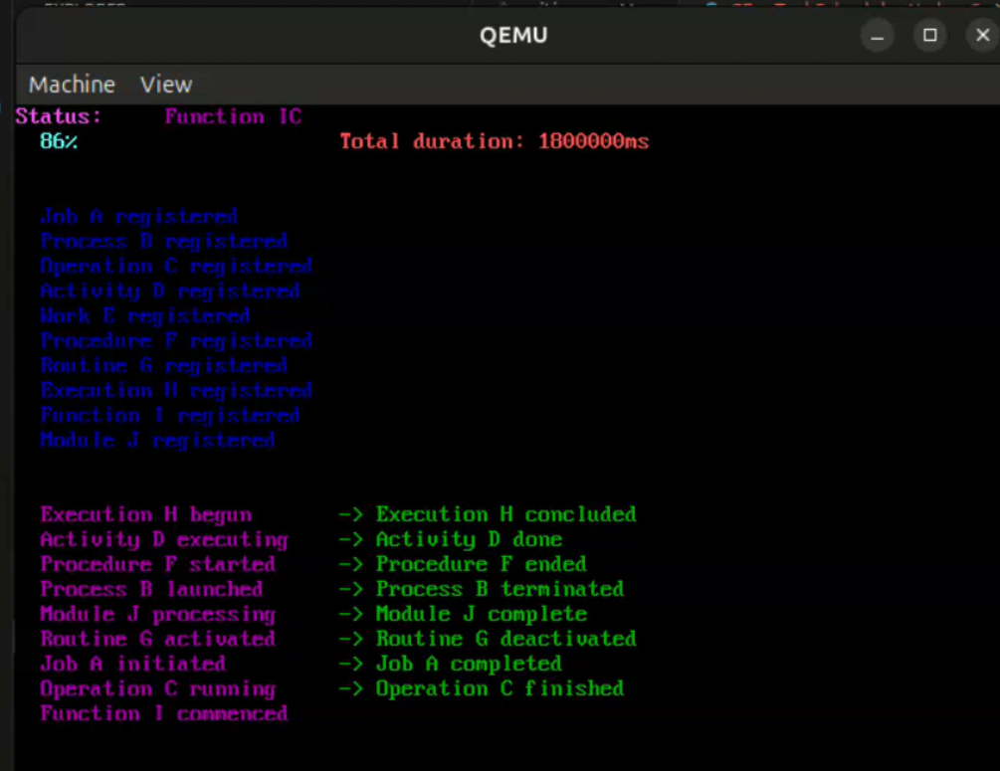

# Отчет по лабораторной работе №42
## Реализация планировщика задач с алгоритмом LJF (Longest Job First) для операционной системы EcoOS



**Longest Job First (LJF)** - алгоритм планирования, при котором задачи выполняются в порядке убывания их длительности:

1. Из списка доступных задач выбирается задача с максимальной длительностью (`maxDuration`)
2. Выбранная задача выполняется до завершения (невытесняющий алгоритм)
3. После завершения задача удаляется из списка
4. Процесс повторяется для оставшихся задач

**Характеристики:**
- **Тип**: невытесняющий (non-preemptive)
- **Среднее время ожидания**: высокое (короткие задачи ждут долго)
- **Пропускная способность**: низкая для коротких задач
- **Применение**: специфические сценарии, где длинные задачи имеют приоритет

---

## Исходный код реализации компонента

### Структура задачи (CEcoTask1Lab.h)

```c
typedef struct CEcoTask1Lab_C761620F {
    IEcoTask1VTbl* pVTbl;
    uint32_t m_cRef;

    /* Данные задачи */
    void (*pfunc) (uint64_t);  // Указатель на функцию задачи
    uint64_t duration;         // Длительность выполнения задачи

    /* Ссылка на системный таймер */
    IEcoTimer1* m_pSysTimer;
} CEcoTask1Lab_C761620F;
```

### Ключевой код планировщика (CEcoTaskScheduler1Lab.c)

#### Создание задачи

```c
#define MAX_STATIC_TASK_COUNT 10

int16_t ECOCALLMETHOD CEcoTaskScheduler1Lab_C761620F_NewTask(
    IEcoTaskScheduler1Ptr_t me,
    voidptr_t address,
    uint64_t duration,
    uint32_t stackSize,
    IEcoTask1** ppITask
) {
    int32_t indx = 0;
    int32_t reg = 30;
    uint64_t* pxTopOfStack = 0;

    if (me == 0) {
        return ERR_ECO_POINTER;
    }

    /* Проверяем указатель пула статических задач */
    for (indx = 0; indx < MAX_STATIC_TASK_COUNT; indx++) {
        if (g_xCEcoTask1List_C761620F[indx].pfunc == 0) {
            g_xCEcoTask1List_C761620F[indx].pfunc = address;
            g_xCEcoTask1List_C761620F[indx].duration = duration;
            g_xCEcoTask1List_C761620F[indx].m_cRef = 1;
            g_xCEcoTask1List_C761620F[indx].m_sp = (byte_t*)&g_xCEcoStackTask1List_C761620F[indx*4096];
            pxTopOfStack = g_xCEcoTask1List_C761620F[indx].m_sp;
            while (reg > 0) {
                pxTopOfStack--;
                reg--;
            }
            *pxTopOfStack = (uint64_t)g_xCEcoTask1List_C761620F[indx].pfunc;
            *ppITask = (IEcoTask1*)&g_xCEcoTask1List_C761620F[indx];
            return ERR_ECO_SUCCESES;
        }
    }
    return ERR_ECO_OUT_OF_MEMORY;
}
```

#### Запуск планировщика с алгоритмом LJF

```c
int16_t ECOCALLMETHOD CEcoTaskScheduler1Lab_C761620F_Start(
    IEcoTaskScheduler1Ptr_t me
) {
    CEcoTaskScheduler1Lab_C761620F* pCMe = (CEcoTaskScheduler1Lab_C761620F*)me;

    if (me == 0) {
        return ERR_ECO_POINTER;
    }

    g_pxCurrentTCB_C761620F = (uint64_t*)&pCMe->m_pTaskList[0];

    /* Основной цикл планировщика - реализация LJF */
    while (1) {
        size_t i = 0;
        uint64_t maxDuration = 0;

        /* Поиск задачи с максимальной длительностью */
        for (i = 0; i < MAX_STATIC_TASK_COUNT; ++i) {
            if (pCMe->m_pTaskList[i].pfunc != 0 &&
                pCMe->m_pTaskList[i].duration > maxDuration) {
                g_currentTaskIdx = i;
                maxDuration = pCMe->m_pTaskList[i].duration;
            }
        }

        /* Выполнение задачи с максимальной длительностью */
        pCMe->m_pTaskList[g_currentTaskIdx].pfunc(maxDuration);

        /* Удаление выполненной задачи из списка */
        pCMe->m_pTaskList[g_currentTaskIdx].pfunc = 0;
        maxDuration = 0;
        g_currentTaskIdx = 0;
    }

    return ERR_ECO_SUCCESES;
}
```

---

## Сборка компонента

### Конфигурация окружения

```bash
export ECO_TOOLCHAIN=/home/artem-kholev/Desktop/Eco.Lab4
export ECO_FRAMEWORK=/path/to/eco/framework
```

### Сборка статической библиотеки планировщика

```bash
cd Eco.TaskScheduler1Lab/AssemblyFiles/EcoOS/aarch64_gcc_13_2_1/
bash build.sh
```

**Результат:**
```
BuildFiles/EcoOS/arm64-v8a/StaticDebug/lib902ABA722D34417BB714322CC761620F.a
```

### Сборка образа ядра

```bash
cd MySimpleEcoOS/AssemblyFiles/EcoOS/aarch64_gcc_13_2_1/
make clean
make Pi3-64
```

---

#### Визуализация прогресса выполнения

Реализована функция отображения прогресса с анимированной крутилкой и процентами:

```c
/* Обработчик таймера для анимации крутилки */
void TimerHandler(void) {
    if (g_strTask[0] == '\\') g_strTask[0] = '|';
    else if (g_strTask[0] == '|') g_strTask[0] = '/';
    else if (g_strTask[0] == '/') g_strTask[0] = '-';
    else g_strTask[0] = '\\';
}

/* Вывод прогресса: крутилка + проценты */
void printProgress() {
    /* Крутилка (cyan) */
    g_pIVideo->pVTbl->WriteString(g_pIVideo, 0, 0, 0, 1,
                                   CHARACTER_ATTRIBUTE_FORE_COLOR_LIGHT_CYAN,
                                   g_strTask, 1);
    /* Проценты (cyan) */
    PrintPercent(task_progress, 2, 1);
}
```

#### Определение задач

```c
/* Task 1: Job A - длительность 3500000 */
void Task1(uint64_t duration) {
    PrintDuration(duration);
    uint64_t currentTime = g_pISysTimer->pVTbl->get_SingleTimerCounter(g_pISysTimer);
    uint64_t endTime = currentTime + duration;
    task_progress = 0;
    ++row_pointer;

    /* Вывод статуса задачи */
    g_pIVideo->pVTbl->WriteString(g_pIVideo, 0, 0, 2, row_pointer,
                                   CHARACTER_ATTRIBUTE_FORE_COLOR_MAGENTA,
                                   "Job A initiated", 15);
    g_pIVideo->pVTbl->WriteString(g_pIVideo, 0, 0, 12, 0,
                                   CHARACTER_ATTRIBUTE_FORE_COLOR_MAGENTA,
                                   "Job A", 5);

    /* Цикл выполнения с обновлением прогресса */
    while (endTime >= currentTime) {
        if (changeTime <= currentTime) {
            task_progress = (changeTime - startTime) * 100 / duration;
            printProgress();  /* Крутилка + проценты */
            changeTime += duration / 100;
        }
        currentTime = g_pISysTimer->pVTbl->get_SingleTimerCounter(g_pISysTimer);
    }

    g_pIVideo->pVTbl->WriteString(g_pIVideo, 0, 0, 25, row_pointer,
                                   CHARACTER_ATTRIBUTE_FORE_COLOR_GREEN,
                                   " -> Job A completed", 19);
}

/* Аналогично реализованы Task2 - Task10 */
```

#### Таблица задач

| Задача | Имя | Длительность | Описание выполнения |
|--------|-----|--------------|---------------------|
| Task1 | Job A | 3500000 | "Job A initiated" → "Job A completed" |
| Task2 | Process B | 6000000 | "Process B launched" → "Process B terminated" |
| Task3 | Operation C | 2500000 | "Operation C running" → "Operation C finished" |
| Task4 | Activity D | 9000000 | "Activity D executing" → "Activity D done" |
| Task5 | Work E | 1200000 | "Work E executing" → "Work E accomplished" |
| Task6 | Procedure F | 7500000 | "Procedure F started" → "Procedure F ended" |
| Task7 | Routine G | 4000000 | "Routine G activated" → "Routine G deactivated" |
| Task8 | Execution H | 10000000 | "Execution H begun" → "Execution H concluded" |
| Task9 | Function I | 1800000 | "Function I commenced" → "Function I terminated" |
| Task10 | Module J | 5200000 | "Module J processing" → "Module J complete" |

#### Инициализация планировщика и создание задач

```c
int16_t EcoMain(IEcoUnknown* pIUnk) {
    IEcoTaskScheduler1* pIScheduler = 0;
    IEcoTask1* pITask1 = 0;
    /* ... pITask2 - pITask10 ... */
    IEcoTimer1* pITimer = 0;

    /* Получение интерфейса планировщика */
    result = pIBus->pVTbl->QueryComponent(pIBus, &CID_EcoTaskScheduler1Lab,
                                          0, &IID_IEcoTaskScheduler1,
                                          (void**)&pIScheduler);

    /* Вывод статуса (magenta) */
    pIVideo->pVTbl->WriteString(pIVideo, 0, 0, 0, 0,
                                CHARACTER_ATTRIBUTE_FORE_COLOR_LIGHT_MAGENTA,
                                "Status: ", 8);

    /* Инициализация планировщика */
    pIScheduler->pVTbl->InitWith(pIScheduler, pIBus, &__heap_start__+0x090000, 0x080000);

    /* Создание 10 задач */
    result = pIScheduler->pVTbl->NewTask(pIScheduler, Task1, 3500000ul, 0x100, &pITask1);
    pIVideo->pVTbl->WriteString(pIVideo, 0, 0, 2, row_pointer,
                                CHARACTER_ATTRIBUTE_FORE_COLOR_BLUE,
                                "Job A registered", 16);
    /* ... Task2 - Task10 ... */

    /* Настройка таймера для анимации крутилки */
    pITimer->pVTbl->set_Interval(pITimer, 100000);
    pITimer->pVTbl->set_IrqHandler(pITimer, TimerHandler);
    pITimer->pVTbl->Start(pITimer);

    /* Запуск планировщика LJF */
    pIScheduler->pVTbl->Start(pIScheduler);
}
```

### Порядок выполнения задач по алгоритму LJF

Согласно алгоритму LJF, задачи выполняются в следующем порядке (от максимальной к минимальной длительности):

1. **Task8 (Execution H)** - длительность 10000000 (максимальная)
2. **Task4 (Activity D)** - длительность 9000000
3. **Task6 (Procedure F)** - длительность 7500000
4. **Task2 (Process B)** - длительность 6000000
5. **Task10 (Module J)** - длительность 5200000
6. **Task7 (Routine G)** - длительность 4000000
7. **Task1 (Job A)** - длительность 3500000
8. **Task3 (Operation C)** - длительность 2500000
9. **Task9 (Function I)** - длительность 1800000
10. **Task5 (Work E)** - длительность 1200000 (минимальная)

---

## Запуск на эмуляторе QEMU

### Команда запуска (графический режим)

```bash
env -i PATH=/usr/bin:/bin TERM=$TERM HOME=$HOME DISPLAY=$DISPLAY \
  XAUTHORITY=$XAUTHORITY /usr/bin/qemu-system-aarch64 \
  -M raspi3b -kernel kernel8.img
```

### Команда запуска (текстовый режим)

```bash
env -i PATH=/usr/bin:/bin TERM=$TERM /usr/bin/qemu-system-aarch64 \
  -M raspi3b -kernel kernel8.img -nographic
```

**Выход**: `Ctrl+A`, затем `X`

---

## Анализ и выводы - Характеристики алгоритма LJF

**Преимущества:**
- Простота реализации
- Детерминированное поведение
- Подходит для систем с известными длительностями задач
- Гарантированное выполнение длинных задач без ожидания

**Недостатки:**
- Очень высокое среднее время ожидания для коротких задач
- Проблема "голодания" (starvation) коротких задач
- Неэффективен для интерактивных систем
- Требует априорного знания длительности задач
